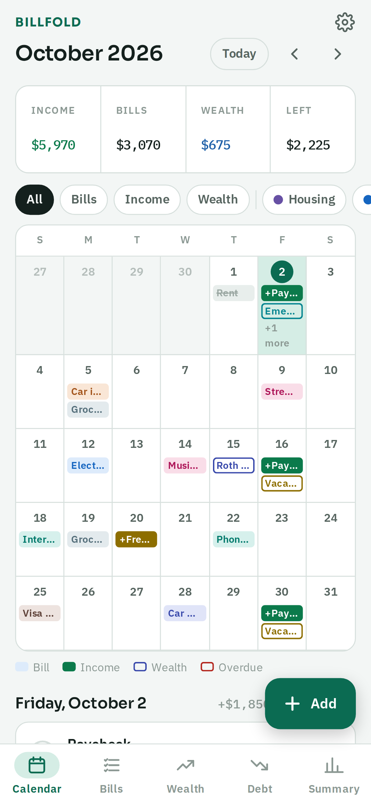
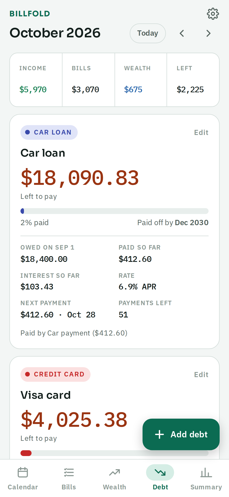
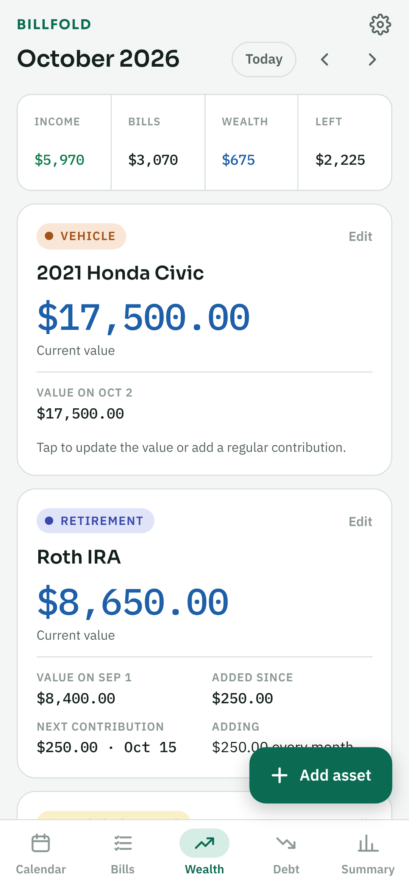
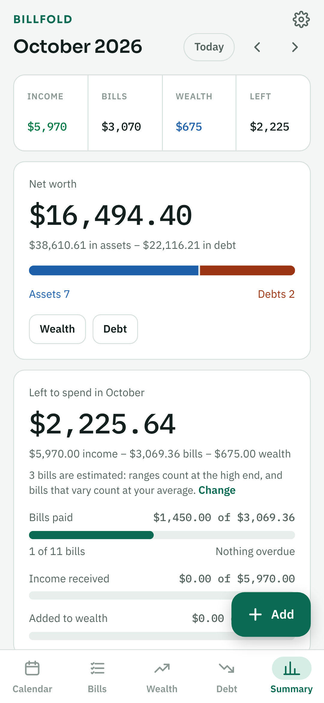

# Billfold

**Alpha v0.5** · Android 8.0+ · License: GPL-3.0-or-later

Billfold is a bill, income, wealth and debt tracker built around a month calendar.
Bills show up on their due dates and you check them off when they're paid.
Everything stays on your phone: no account, no tracking, and offline unless you turn on live metal prices.

<p>




</p>

## Features

- **Calendar** with colored categories, filters, and paid / overdue states
- **Bills and income** with flexible repeats (every N days/weeks/months/years, twice a month, end after N times or on a date)
- **Fixed, range ($200–$300) and varying amounts**, with settings for how unpaid amounts are counted, separately for money in and out
- **Per-payment changes**: enter the actual amount, move one payment, or skip it
- **Debt tracking**: link payments to a loan or card; checked-off payments come off the balance, with interest and a payoff date
- **Wealth**: assets (savings, retirement, investments, precious metals, property and more) with linked contributions, growth and goals; metals by weight with optional live spot prices
- **Net worth** on the Summary tab
- **Home-screen widgets**: upcoming bills, this month, debt left
- **Bill reminders** (notifications)
- **CSV export**, backup and restore, 6 color themes, light and dark mode

## Install

1. Open the [latest release](https://github.com/dirty392/Billfold/releases) on your phone and download the `.apk` file.
2. Open the downloaded file. If Android asks, allow installs from your browser or file manager.
3. Open Billfold. To look around first, tap **Or try example data**; you can remove it later in Settings.

Needs Android 8.0 or newer. Updates install over the old version and keep your data.

**Billfold is in alpha.** Things may change between versions. Save a backup now and then from Settings → Backup.

## Privacy

Billfold has no account, no ads and no tracking. It only goes online if you turn on live metal prices, and then it asks for prices only. Your data never leaves your phone unless you export or back it up yourself. See [PRIVACY.md](PRIVACY.md).

## Feedback

Found a bug or have an idea? [Open an issue](https://github.com/dirty392/Billfold/issues).

## Build from source

Needs Java 17+ (21 used), Python 3, and npm, on Linux or macOS.

```sh
sh ./fetch_tools.sh   # once: downloads aapt2, android.jar, d8, apksigner and ecj into ./tools
sh ./build.sh         # builds and signs Billfold.apk
```

`build.sh` signs with `release.keystore`, which is **not in this repository**. The maintainer keeps it privately.
To build your own copy, create your own key (`keytool -genkeypair -keystore release.keystore -alias billfold -storepass billfold -keypass billfold -keyalg RSA -keysize 2048 -validity 10000 -dname "CN=Billfold"`); it won't install over the official build.

## Project layout

- `assets/index.html` — the whole app UI and logic (HTML, CSS and JavaScript in one file). It also runs in a desktop browser for quick testing.
- `assets/fonts/` — bundled Sora, IBM Plex Sans and IBM Plex Mono (SIL Open Font License; see `assets/fonts/licenses/`).
- `src/com/billfold/app/` — Android shell: WebView host, JavaScript bridge, reminders, home-screen widgets.
- `res/` — theme, launcher and notification icons, widget layouts.
- `AndroidManifest.xml`, `build.sh`, `fetch_tools.sh`.
- `fastlane/metadata/` — store listing text, icon and screenshots (used by F-Droid).
- `ROADMAP.md` — planned features and release notes.

## License

Billfold is free software under the GNU General Public License v3.0 or later. See `LICENSE`.
Fonts are under the SIL Open Font License 1.1.
